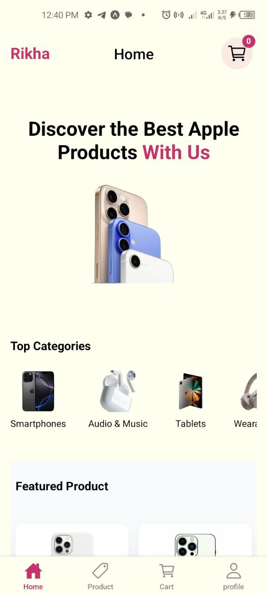
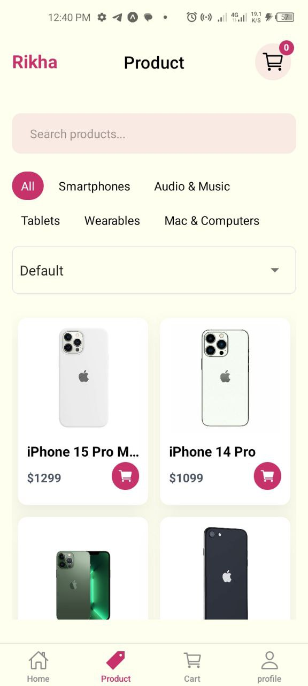
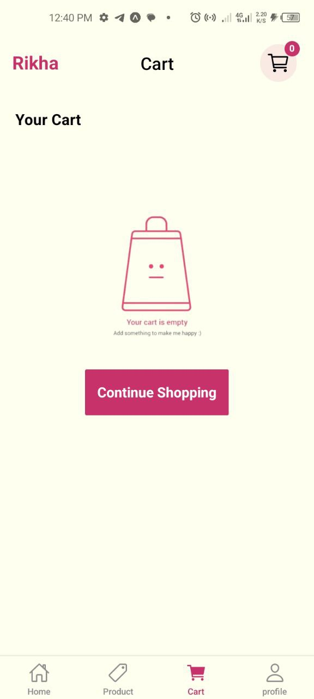
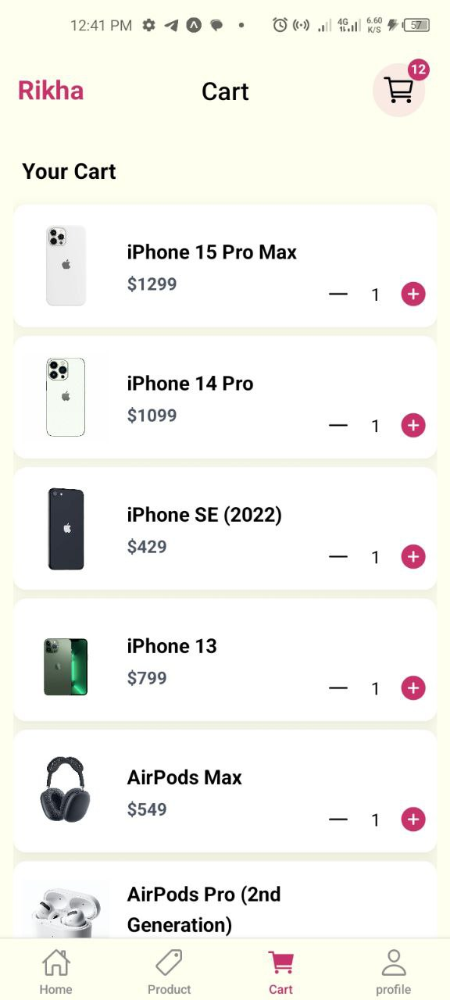

<h1 style="color:red; font-size: 50px; font-family:sans-serif ;">RIkha</h1>


## Screenshots


<table>
  <tr>
    <td style="vertical-align: top; padding: 10px;">
      
    </td>
    <td style="vertical-align: top; padding: 10px;">
      
    </td>
  </tr>
  <tr>
    <td style="vertical-align: top; padding: 10px;">
      
    </td>
    <td style="vertical-align: top; padding: 10px;">
      
    </td>
  </tr>
  <tr>
    <td style="vertical-align: top; padding: 10px;">
      
    </td>
  </tr>
</table>


## Table of Contents

1. [Introduction](#introduction)
2. [Features](#features)
3. [Technology Stack](#technology-stack)
4. [Project Structure](#project-structure)
5. [API Endpoints](#database-Schema)
6. [Authors](#authors)
7. [License](#license)


## Introduction

# 🚀 Rikha

Rikha is a **mobile-first e-commerce app** built with React Native. It helps users **browse, explore, and shop products seamlessly** on their mobile devices.

### 🔧 What It Does

- **Browse Products** – Quickly view products by category.
- **Product Details** – See images, description, and price.
- **Add to Cart** – Manage items before checkout.
- **Pagination & Infinite Scroll** – Smooth browsing for large product lists.

### 🤝 Why Use Rikha?

- 📱 **Mobile-First Design** – Intuitive interface built for React Native.
- ⚡ **Fast & Responsive** – Optimized for smooth performance.
- 🛠️ **Robust Backend** – Powered by Express.js with Prisma ORM for database management.
- ✅ **Scalable Architecture** – Easy to add features like authentication, checkout, or payments in the future.


## 🚀 Features

Rikha’s app is designed for clarity, speed, and usability. Here's what it includes:

- **🏠 Home Page**  
  Overview of products and categories with smooth navigation.

- **🛍️ Product Page**  
  Browse products with pagination and infinite scroll for seamless exploration.

- **📄 Product Detail Page**  
  In-depth view of a selected product with images and description.

- **🛒 Cart Page**  
  Add/remove items and see a summary of selected products.


## 🛠️ Technology Stack

- **Frontend**: React Native, Expo, Redux Toolkit + RTK Query, NativeWind (Tailwind CSS)  
- **Backend**: Express.js, Prisma ORM  
- **Database**: PostgreSQL/MySQL (via Prisma)  


## Project Structure
   ```plaintext
.
├── README.md
├── app
│   ├── (tabs)
│   │   ├── _layout.tsx
│   │   ├── cart.tsx
│   │   ├── index.tsx
│   │   ├── product.tsx
│   │   └── profile.tsx
│   ├── +not-found.tsx
│   ├── _layout.tsx
│   └── product
│       └── [slug].tsx
├── app.json
├── assets
│   └── images
│       ├── android-icon-background.png
│       ├── android-icon-foreground.png
│       ├── android-icon-monochrome.png
│       ├── cart1.jpg
│       ├── cart2.jpg
│       ├── emptycart.png
│       ├── favicon.png
│       ├── hero2.png
│       ├── home.jpg
│       ├── icon.png
│       ├── partial-react-logo.png
│       ├── product.jpg
│       ├── productDetail.jpg
│       ├── react-logo.png
│       ├── react-logo@2x.png
│       ├── react-logo@3x.png
│       └── splash-icon.png
├── babel.config.js
├── components
│   ├── CartCard.tsx
│   ├── CategoryFilter.tsx
│   ├── EmptyCart.tsx
│   ├── ProductCard.tsx
│   ├── SkeletonLoader.tsx
│   └── SortPicker.tsx
├── eas.json
├── eslint.config.js
├── expo-env.d.ts
├── global.css
├── guide.tx
├── interface
│   └── index.ts
├── metro.config.js
├── nativewind-env.d.ts
├── package-lock.json
├── package.json
├── redux
│   ├── api
│   │   ├── categoriesApi.ts
│   │   └── productApi.ts
│   ├── hooks.ts
│   ├── slices
│   │   └── cartSlice.ts
│   ├── store.ts
│   └── storeProvider.tsx
├── tailwind.config.js
└── tsconfig.json
```  

 


    
## 📡 API Endpoints

The backend provides a REST API that powers the Rikha e-commerce app.  

### **Products**
- **GET** `/products`  
  → Fetch all products.  

- **GET** `/products/:slug`  
  → Fetch product details by slug.  

- **GET** `/products/featured`  
  → Fetch featured products.  

- **GET** `/products/new-arrivals`  
  → Fetch new arrival products.  

- **GET** `/products/:category/related`  
  → Fetch related products by category ID.  


   ## Author

**Hanan Abdulshikur**  
- [GitHub](https://github.com/devhan-hub)  
- [LinkedIn](https://linkedin.com/in/hanan-abdulshikur)

---

## License

This project is licensed under the **MIT License**.  
Copyright &copy; 2025 Hanan Abdulshikur.
